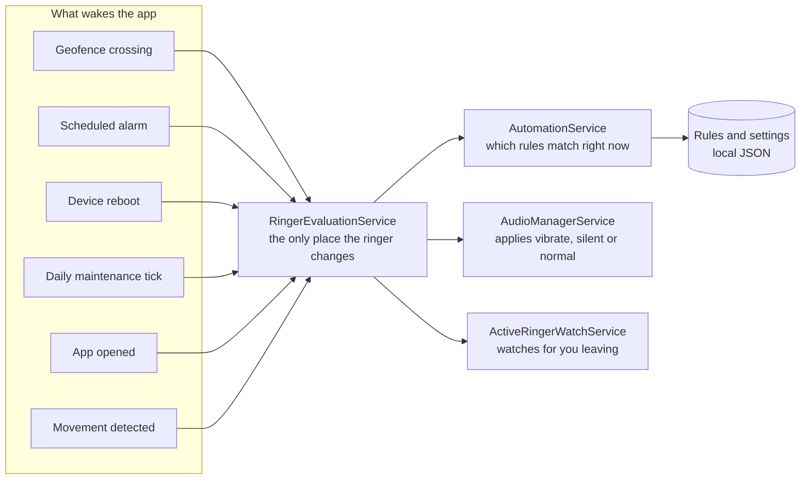
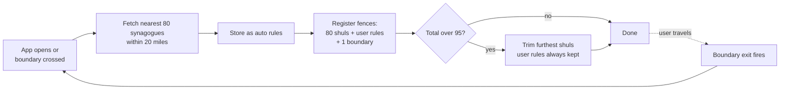
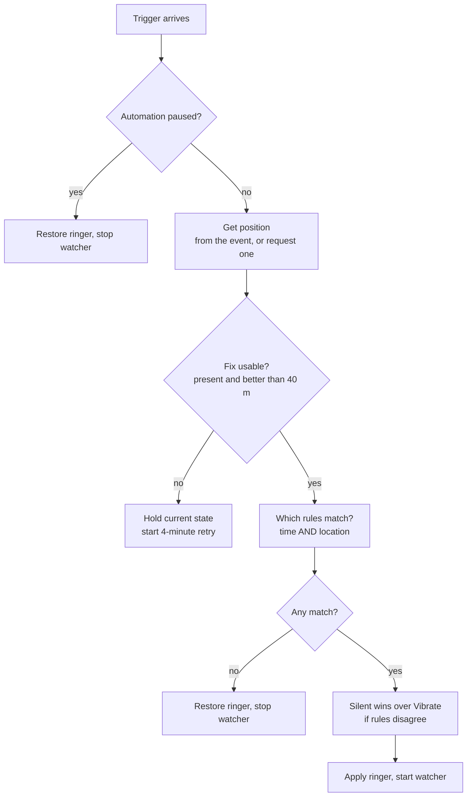
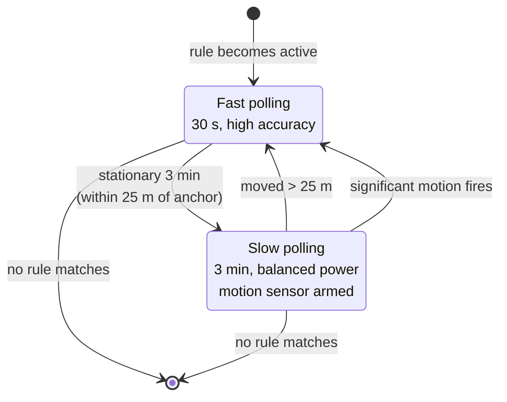

# Architecture

How "VibrateAuto" decides what setting your ringer should be, and how it stays active long enough to do it.

---

## 1. The shape of the system

The app has no backend. Everything runs on the phone, and the operating system does most of the waiting.

**The one rule that governs the design:** every trigger ends at `RingerEvaluationService`. Nothing else is allowed to change the ringer. An earlier version had several independent paths, and it was possible to re-register geofences without re-checking the ringer, which is how a phone could reboot after leaving shul and stay on vibrate indefinitely.

---

## 2. The rule model

One type describes both kinds of rule.

| Field | Meaning |
|---|---|
| `Name` | What the user calls it |
| `StartTime`, `EndTime` | Active window. **Equal values mean no time constraint** |
| `Latitude`, `Longitude` | Centre of the place. Zero means no location constraint |
| `RadiusInMiles` | How close counts as "here" |
| `TargetRingerMode` | Vibrate or Silent |
| `IsEnabled` | The user's on/off switch |
| `IsAutoGenerated` | True for synagogues pulled from the directory |

A rule matches when **both** its constraints match, and a constraint it does not use counts as matching. That single convention gives time-only, location-only and combined rules without any branching in the model.

Auto-generated synagogues rules are stored with **negative IDs**, so they can never collide with user rules, and they are replaced wholesale on every sync. Because they are replaced, a user's decision to switch off a particular shul is stored separately, keyed by the directory's shul ID. Travel away and come back, and that synagogues is still turned off.

---

## 3. The geofence strategy: a dynamic boundary

Android rejects a registration request outright if it exceeds **100 geofences**, and a dense neighbourhood has far more synagogues than that.

### Sizing the boundary

The boundary is a single large **exit-only** fence. Crossing it means the cached synagogues list may no longer describe where you are, so the app re-fetches.

Originally the boundary was a fixed 15 miles. Measuring the real data showed why that was wrong: a directory query for central Lakewood returns **414 shuls within 20 miles**, and the nearest 80 all fall inside **1.1 miles**. Driving three miles across town therefore left the user with no fences and no refresh.

The boundary is now sized to the set actually fetched, clamped between half a mile and fifteen. In a dense town it is about a mile; where the API returns fewer results than the cap, meaning the fetch already covered everything in range, it stays at the maximum.

### Fence types

| Fence | Transitions | Why |
|---|---|---|
| Shul | Dwell (30 s loiter) + Exit | Walking or driving past a synagogues should not trigger it. Staying should |
| User rule | Enter + Exit | The user placed this deliberately, so act on arrival |
| Boundary | Exit only, 5 minute responsiveness | Refreshing a list a few minutes late costs nothing, so let the OS batch it and save power |

---

## 4. Deciding the ringer

### The accuracy gate

A position fix worse than **40 metres** is a guess, not a position. Acting on one is how a phone ends up on vibrate at home. When the fix is unusable the app deliberately does nothing rather than assuming you have left, because assuming you have left is what hands your ringer back while you are still davening.

### The retry window

A geofence dwell fires once. If the fix that arrived with it was unusable, the arrival used to be lost entirely, because the watcher only ran once a rule was already active. The app now starts the watcher in a short **four minute high-accuracy retry** instead, which either confirms the arrival or gives up on its own.

### Hysteresis

Entry is confirmed within the rule's own radius. Exit requires being **60 feet beyond** it. Between the two, whatever is currently applied stays applied. Without that band, a fix jittering across a single threshold would toggle the ringer repeatedly.

Entry used to be a fixed 150 feet, which assumed the map pin sits at the door. In a large shul, or where the pin is geocoded to the street, a user could be well inside the fence and never be confirmed.

---

## 5. The battery model

While a rule is active a foreground service watches for you leaving. It has two speeds and a hardware shortcut.

The **significant motion** sensor is the important part. It is a hardware trigger that fires once when the device genuinely starts moving, and costs almost nothing because the sensor chip does the watching. Without it, the app would be blind to you standing up for up to a full slow interval, which is what made leaving feel sluggish. With it, the app returns to fast polling within a second or two of you actually moving.

The stationary threshold is 25 metres rather than something tighter, because at 15 metres normal indoor GPS drift kept re-anchoring the position and the back-off never engaged.

---

## 6. Staying alive

Android is actively hostile to long-running background apps, and correctly so. Four mechanisms keep the app functional.

| Mechanism | Problem it solves |
|---|---|
| Boot receiver | Geofences and alarms do not survive a reboot |
| Daily maintenance alarm | A health check that re-registers everything and re-checks the ringer |
| Battery optimisation exemption | Android shuts down apps idle for a few days |
| Stale-override watchdog | If the ringer has been held for 3 hours with no confirming fix, hand it back |

The watchdog is the backstop for everything the other three miss: the user force-stopped the app, Play Services dropped the fences, or location was switched off entirely.

---

## 7. Setup and permissions

Geofencing needs more from the user than most apps, and each request fails differently. The setup screen is a checklist rather than a burst of system dialogs, showing for each item what it is for, what to tap, and whether it is done.

| Requirement | Required | Why |
|---|---|---|
| Google Play Services | Yes | Geofencing and fused location both come from it. Without it nothing location-based works, and it fails invisibly |
| Location | Yes | Knowing where you are |
| Background location | Yes | Working with the app closed. Android forces this as a separate second step |
| Notifications | Yes | The active-rule notice and its restore action |
| Battery optimisation exemption | Yes | Surviving several idle days |
| Do Not Disturb access | No | Only needed for rules set to full Silent |
| Exact alarms | No | Only needed for time-based rules |

Nothing opens a system screen on its own. The user presses a button first, every time.

---

## 8. Deliberate non-goals

- **No backend, no accounts, no analytics.** The only network calls are the shul directory lookup and address search. There is nothing to breach.
- **No light theme.** The audience and the device are fixed, and a second theme is surface area with no benefit.
- **Android only.** iOS scaffolding exists in the codebase, but iOS caps region monitoring at 20 regions, which breaks the whole dynamic-boundary strategy and would need a different design.
- **No dependency injection framework, no MVVM toolkit.** At this size the indirection would cost more than it returns.

